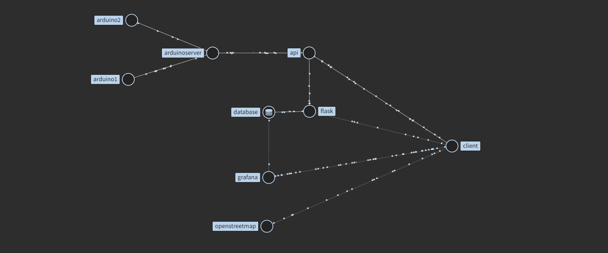

# Architecture

>Global Arch

    

>Website

Bikeeper website folders are organized in this way : 

| Folder | What's inside ? | 
| ---------- |------------|
| **api**         |api to interact with bikeeper sms server using REST API          |
| **static**         | All assets files (images,css,js)           |
|**templates** |All templates are inside. Bikeeper use 2 types of templates, mobile template and pc template.|
|**views** |All the views are bind to routes.|