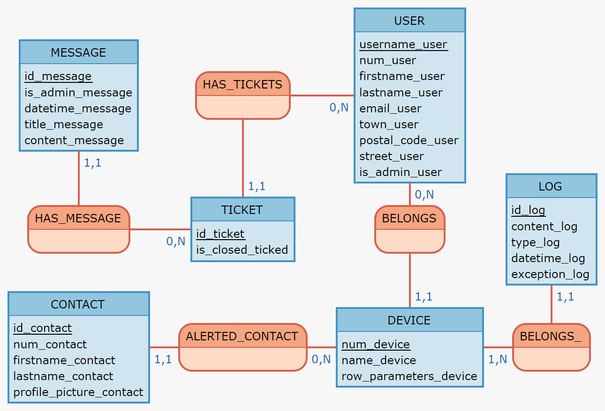

# Models


> Database

We create this tables representation



---

> ORM

?> **Tip** To interact with our database we use [sqlalchemy](https://www.sqlalchemy.org/). 

Sqlalchemy provide a easy to use query system and a fast sql table creation. 

To call our database `app.py`
```python
app.config['SQLALCHEMY_DATABASE_URI'] = 'mysql+pymysql://{}:{}@{}/BIKEEPER'.format(os.environ.get('SERVER_USER'),os.environ.get('SERVER_PASSWORD'), os.environ.get('SERVER_IP'))

# Module that will build python objects
db = SQLAlchemy(app)

# Engine connecting to MariaDB
engine = sqlalchemy.create_engine(app.config['SQLALCHEMY_DATABASE_URI'], echo=False)  # , isolation_level="READ  

```

--- 

All tables are represented like this. 

```python 
class LOG(db.Model):
    """
    Store all activities generated by Bikeepers like Alerts, Moving etc...
    """
    id_log = db.Column(db.Integer, primary_key=True, autoincrement=True)
    content_log = db.Column(db.String(150))
    type_log = db.Column(db.String(20))
    datetime_log = db.Column(DateTime())
    exception_log = db.Column(db.String(160))
    num_device = db.Column(db.String(15), db.ForeignKey("DEVICE.num_device"))
    DEVICE = db.relationship("DEVICE", backref=db.backref("LOG", lazy="dynamic"))

    def __init__(self, content_log, type_log, datetime_log, exception_log, num_device):
        self.content_log = content_log
        self.type_log = type_log
        self.datetime_log = datetime_log
        self.exception_log = exception_log
        self.num_device = num_device

    def serialize(self):
        return {
            "id_log": self.id_log,
            "content_log": self.content_log,
            "type_log": self.type_log,
            "datetime_log": self.datetime_log,
            "exception_log": self.exception_log,
            "num_device": self.num_device
        }

```

?> **Tip** `serialize` method allow us to print directly the object. 


--- 

To make queries, we defined functions that return an Object defined in model class.

```python 
@staticmethod
    def get_last_message_by_ticket_id(ticket_id):
        """
        return: last message of the tickets
        """
        dict_message = ORM.get_message_by_ticket_id(ticket_id)
        if not dict_message:
            return {}
        return dict_message[max(dict_message.keys())]

    @staticmethod
    def messages_to_json(messages):
        """
        Turn the given messages into a json form
        """
        return jsonify(messages)

    @staticmethod
    def get_open_ticket():
        """
        :return: opened tickets,
        """
        res = session.query(TICKET).filter(TICKET.is_closed_ticket == 0).all()
        db.session.commit()
        return res
```